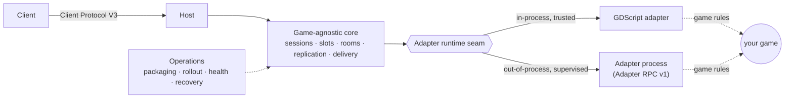

# Match Platform

Engine-neutral contracts and runtimes for authoritative multiplayer games.

This repository owns:

- Client Protocol V3 envelopes and the Godot platform core;
- Adapter RPC v1, generated Go/Python bindings and conformance fixtures;
- supervised process runtime, durable recovery and package operations;
- custom-protocol gateway SDK;
- standalone counter-game reference adapters.

Game rules, presentation, content and game-specific codecs belong in downstream
repositories or in a first-party `games/<name>/` directory. The platform core
still builds and runs without any game source; game code never leaks into
`platform/` (enforced by `tests/platform_core_test.gd`).

## Architecture

A client talks to a host over the wire; the host runs the **game-agnostic core**,
which drives your **game adapter** through a runtime seam. The adapter can run
in-process (trusted GDScript) or out-of-process (supervised, over Adapter RPC v1) —
the core is identical either way. Game code never enters the core.



Deeper detail, more diagrams (join, per-tick replication, recovery), and the
component reference live in the docs:

- **[docs/architecture.md](docs/architecture.md)** — the full system overview.
- [docs/match-platform-core.md](docs/match-platform-core.md) — the game-agnostic core mechanics.
- [docs/adapter-runtime-seam.md](docs/adapter-runtime-seam.md) — the in-process/out-of-process seam.
- [docs/operations-sdk.md](docs/operations-sdk.md) — packaging, rollout, health, metadata, auth.
- [docs/integration-guide.md](docs/integration-guide.md) — how to put a game on the platform.

## Building a game on the platform

Start with **[docs/integration-guide.md](docs/integration-guide.md)** — the
end-to-end guide to the two integration surfaces (the server-side game adapter and
the client V3 protocol), with a worked example.

- **[games/neon-shooter](games/neon-shooter)** — a complete, tested first-party
  reference game (2–8 player authoritative platform shooter): adapter, codec,
  multi-arena lobby + rotation, WebSocket host and a predicting client. Copy from
  it when writing your own game. See its [README](games/neon-shooter/README.md).
- **[adapters/reference](adapters/reference)** — the minimal counter game, the
  smallest possible adapter+codec proving the core can run a second ruleset.

## Quick verification

```sh
bash tests/run_adapter_rpc_conformance.sh
bash tests/run_godot_conformance.sh
```

The RPC module is imported as:

```text
github.com/chimerakang/match-platform/rpc
```

Downstream Godot projects may pin this repository as a submodule and preload
resources below `match-platform/platform`, `match-platform/operations` and
`match-platform/adapters/reference`.

See [support and ownership](SUPPORT.md), [versioning](VERSIONING.md), and the
[migration/rollback runbook](docs/migration-and-rollback.md).
