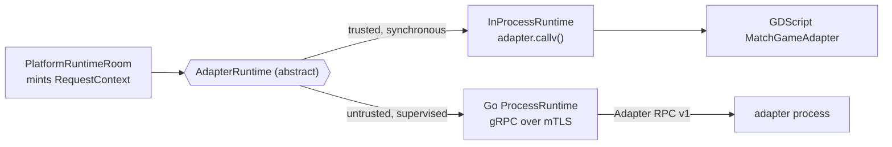

# Adapter runtime seam (GDScript)

The seam that lets **either** a trusted in-process GDScript adapter **or** an
untrusted out-of-process RPC adapter back the same core, without the core (or an
integrator) knowing which. It is the GDScript half of the dual execution model;
the Go half is [adapter-process-runtime.md](adapter-process-runtime.md). Rationale:
[ADR 0005](adr/0005-adapter-rpc-v1.md) (#273).

## Why a seam

`MatchGameAdapter` is a synchronous, trusted, in-address-space object. An
out-of-process adapter is asynchronous, supervised, and reached over gRPC. To make
those interchangeable, the core never calls a `MatchGameAdapter` directly — it
calls an **`AdapterRuntime`**, whose every operation returns an
**`AdapterRuntimeCall`** (a result-oriented promise) carrying a per-call
**identity/ordering/deadline context** identical to Adapter RPC v1's.



## Components

### `AdapterRuntimeCall` (`platform/adapter_runtime_call.gd`)

One invocation's result. A local runtime completes it before returning; a process
runtime may complete it later — callers don't change.

| member | purpose |
| --- | --- |
| `operation`, `request_id`, `context` | what call this is |
| signal `finished(result)` | fired once on completion |
| `complete(result)` | idempotent completion |
| `is_completed()` / `result_now()` | poll (`runtime_pending` reject if not done) |
| `wait()` | `await finished` |

Result shape: `{ok, value, meta}` where `ok` is **runtime** success. A completed
call can still carry an adapter *rejection* in `value` — runtime success and game
acceptance are deliberately separate.

### `AdapterRuntime` (`platform/adapter_runtime.gd`)

The abstract execution boundary. Every `MatchGameAdapter` operation appears here as
a method taking a `context: Dictionary` and returning an `AdapterRuntimeCall`
(`package_descriptor`, `slot_descriptors`, `validate_match_config`, `create_match`,
`recover_match`, `validate_join`, `validate_command`, `apply_command`, `advance`,
`terminal_result`, `state_hash`, `export_replay`, `build_checkpoint`,
`build_delta`, `drain_events`, `metrics`). Plus:

- `runtime_identity()` → `{runtime_id, runtime_epoch, adapter_instance_id, adapter_epoch}`;
- `telemetry()`;
- signal `call_observed(report)` — one report per call (operation, latency, ok, rejection);
- `_meta(...)` stamps every result with operation / request_id / match_id /
  expected_tick / deadline / identity / latency.

The base returns `runtime_not_implemented` for everything; concrete runtimes
override.

### `InProcessRuntime` (`platform/in_process_runtime.gd`)

The trusted, synchronous runtime — wraps a `MatchGameAdapter` object and drives it
with `callv`. `register()` on the adapter registry uses this, so an in-process
game "just works". Behaviour:

- missing method → `runtime_method_unavailable` failure (not a crash);
- an adapter Dictionary return with `ok:false`/`code` is surfaced as an adapter
  *rejection* inside a runtime *success*;
- records latency + call/failure/rejection counters, emits `call_observed`;
- `runtime_id` defaults to `"in-process:<instance_id>"`.

### `PlatformRuntimeRoom` (`platform/platform_runtime_room.gd`)

The per-match execution owner. Holds one `AdapterRuntime`, the `match_id`, a
monotonic `request_id`, and a deadline. Its thin methods (`validate_join`,
`validate_command`, `apply_command`, `advance`, `build_checkpoint`, `build_delta`,
`drain_events`, `terminal_result`, `state_hash`, `export_replay`, `metrics`) each
take `expected_tick` and forward through the runtime with a freshly-minted context:

```
{ protocol: {major:1, minor:0}, match_id, adapter_instance_id, adapter_epoch,
  request_id, expected_tick, deadline_unix_ms }
```

**This tuple is exactly Adapter RPC v1's per-call contract** — which is what makes
the in-process and out-of-process paths call-shape-identical.

## Using it

Direct (what neon-shooter does today):

```gdscript
var ack := adapter.validate_command(slot, payload)
if ack.ok: adapter.apply_command(slot, payload)
```

Through the seam (adapter location becomes swappable):

```gdscript
var room := PlatformRuntimeRoom.new(runtime, match_id)   # runtime = InProcessRuntime or a process runtime
var call := room.validate_command(slot, payload, expected_tick)
var result := call.wait()          # local runtime is already complete
if result.ok and result.value.ok:
    room.apply_command(slot, payload, expected_tick)
```

Both are valid. The direct form is simplest for a trusted single-process game; the
seam is what you use to move an adapter out of process (or to run an untrusted /
non-Godot adapter) without touching the surrounding core.

## Relationship to the Go path

`InProcessRuntime` is the trusted counterpart of the Go
[`ProcessRuntime`](adapter-process-runtime.md): same operation surface, same
`runtime_identity` / epoch model, same telemetry shape. The process runtime adds
supervision (restart, circuit breaker, liveness), durable recovery, and sandboxed
packaging — everything needed to run an *untrusted* adapter that the in-process
path does not require.
