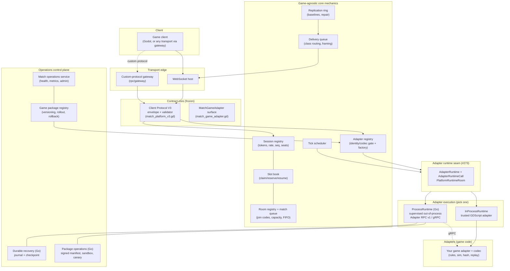
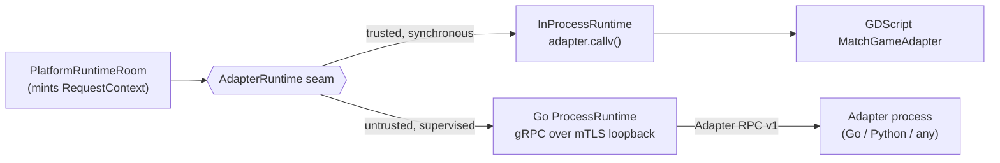
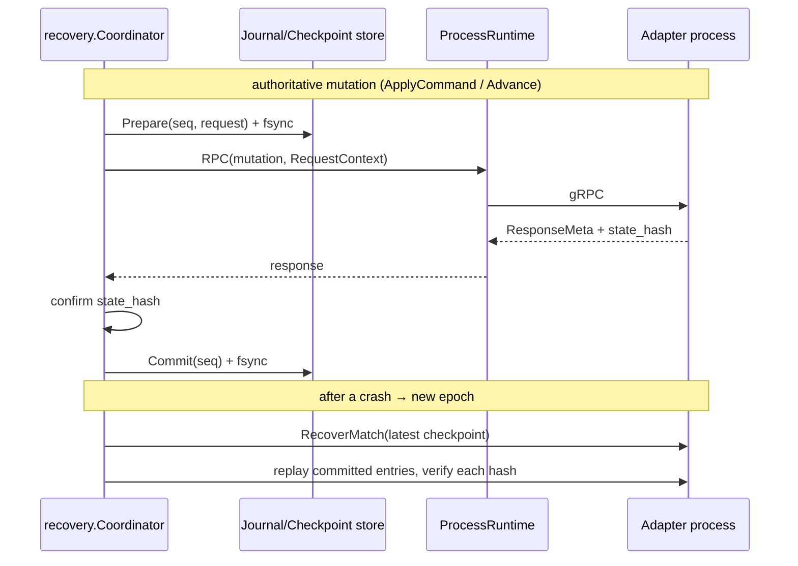
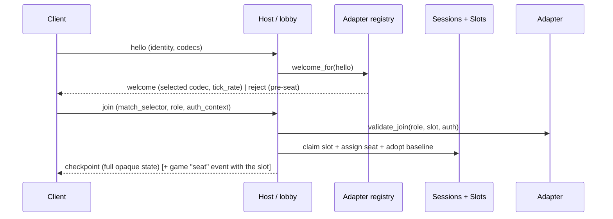
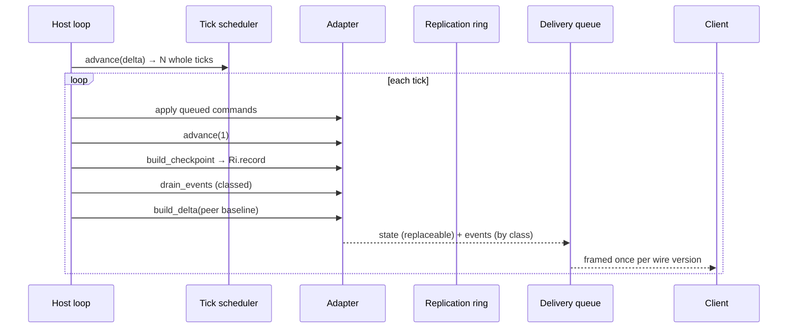

# Match Platform — system architecture

This is the top-level architecture overview: what the pieces are, how they fit,
and where the boundaries sit. For hands-on integration see
[integration-guide.md](integration-guide.md); for the frozen contracts see
[ADR 0003 (Client Protocol V3)](adr/0003-match-platform-v3-contract.md) and
[ADR 0005 (Adapter RPC v1)](adr/0005-adapter-rpc-v1.md).

## What this is

Match Platform is an **engine-neutral runtime for authoritative multiplayer
games**. It owns transport framing, the client wire protocol, session/seat/room
management, state replication and adapter execution — everything that is the same
across games — and pushes every game-specific decision behind a single **adapter**
surface. It was extracted from the `chimerakang/hersir` game so the platform could
be reused and versioned independently (see
[source-attribution.md](source-attribution.md) and
[migration-and-rollback.md](migration-and-rollback.md)); the protobuf ABI package
`hersir.adapter.rpc.v1` is retained frozen and carries no dependency on that game.

The repository ships two things that are easy to confuse:

- the **platform** (`platform/`, `operations/`, `rpc/`) — reusable, game-agnostic;
- **reference games** — the minimal `adapters/reference` counter and the full
  [`games/neon-shooter`](../games/neon-shooter) shooter — proof the platform runs
  real rulesets without changing the core.

## The one principle: a game-agnostic core

The core never learns a game concept. Every game value crosses the boundary as an
**opaque `payload`** that the core only bounds by size and routes by class. Seat
names, entity kinds, command names, terrain, mode selectors — none of them may
appear in `platform/`. This is not a convention; it is enforced by a directory
scan in `tests/platform_core_test.gd` that fails if a forbidden game token or a
`res://scripts|server|network/…` dependency ever appears under `platform/`.

That boundary is what lets one core seat a two-player abstract-strategy game and a
many-slot shooter with no line changing, and what lets an adapter be swapped for a
new version — or moved out of process entirely — without touching the core.

## Layered architecture



Three concentric layers:

1. **Contract core** — `match_platform_v3.gd` (the wire envelope + validator) and
   `match_game_adapter.gd` (the adapter surface). Frozen; the executable form of
   ADR 0003.
2. **Runtime seam** — `adapter_runtime.gd` / `adapter_runtime_call.gd` /
   `platform_runtime_room.gd`: the indirection that lets *either* an in-process
   GDScript adapter *or* an out-of-process RPC adapter back the same core.
3. **Core mechanics + operations** — the session/slot/room/queue/ring/delivery/
   scheduler books, and the operator-facing control plane. None of them reads a
   payload.

## Contract core

### Client Protocol V3

Eight envelopes (`match_platform_v3.gd`), each a flat object with `pv` (protocol
version = 3) and `t` (type); the game body is always an opaque `payload`.

| direction | messages |
| --- | --- |
| client → server | `hello`, `join`, `command` (+ transport-control: `transport_select`, `rtc_answer`, `rtc_ice`) |
| server → client | `welcome`, `state`, `checkpoint`, `event`, `reject` (+ `rtc_offer`, `rtc_ice`, `transport_status`) |

- **Identity gate**: `hello` must carry `game_id` + `game_version` +
  `content_hash` + `codecs`; a mismatch is refused **before seating** with exactly
  one structured code (`unknown_game`, `unsupported_game_version`,
  `content_hash_mismatch`, `unsupported_codec`, `unsupported_protocol`).
- **Delivery classes** (the core routes by these; the adapter only declares an
  event's class): `reliable` (control/commands, exactly-once), `replaceable`
  (latest state wins — `state`), `droppable` (transient FX, safe to lose).
  Invariant: dropping every `droppable` message for a whole match leaves the
  winner, state hash and replay identical.
- Bounds only: envelopes ≤ 64 KiB; the core never parses inside `payload`.

### The adapter surface

`MatchGameAdapter` is the complete list of game-owned decisions. The core calls
it; it never branches on game concepts itself.

| group | operations |
| --- | --- |
| identity | `package_descriptor`, `slot_descriptors` |
| lifecycle | `validate_match_config`, `create_match(config, seed)`, `recover_match(checkpoint)` |
| seating & commands | `validate_join`, `validate_command`, `apply_command` (enqueue only) |
| simulation | `advance(ticks)` (sole clock), `state_hash`, `terminal_result`, `export_replay` |
| replication | `build_checkpoint`, `build_delta(from_ack_tick)`, `drain_events` (each tagged with a reliability class) |
| telemetry | `metrics` |

The hard rule is **determinism**: same `seed` + same command sequence ⇒ identical
`state_hash` at identical ticks. Use tick counters and a seeded RNG carried inside
the state — never wall-clock or an un-seeded RNG. (neon-shooter's adapter shows a
Node server that used `Date.now()`+`Math.random()` ported to exactly this.)

## The runtime seam and the dual execution model

Everything between the core and the adapter goes through one seam so the adapter's
*location* is swappable:

- `AdapterRuntimeCall` — one result-oriented invocation (`{ok, value}` where `ok`
  is *runtime* success and `value` may itself be an adapter rejection). A local
  runtime completes it synchronously; a process runtime may complete it later
  without changing callers.
- `AdapterRuntime` — the abstract execution boundary: the same operations as
  `MatchGameAdapter`, each returning an `AdapterRuntimeCall`, plus
  `runtime_identity()` and `telemetry()`.
- `PlatformRuntimeRoom` — the per-match execution owner. It mints the monotonic
  `RequestContext` — `{protocol, match_id, adapter_instance_id, adapter_epoch,
  request_id, expected_tick, deadline_unix_ms}` — for every call. **This tuple is
  identical to Adapter RPC v1's per-call contract**, which is what makes
  in-process and out-of-process call-shape-identical.



| | In-process runtime | Out-of-process runtime |
| --- | --- | --- |
| impl | `platform/in_process_runtime.gd` | `rpc/runtime/process_runtime.go` |
| adapter | trusted GDScript object (`callv`) | separate process, `hersir.adapter.rpc.v1` gRPC |
| trust | trusted (same address space) | untrusted (sandboxed, signed package) |
| adds | nothing — lowest latency | supervision, durable recovery, packaging, gateway |
| used by | `games/neon-shooter`, reference counter | `rpc/reference/counter` process |

They are **parallel implementations of one adapter contract** — same 18
operations, same identity/epoch/ordering model, same telemetry shape.

## Core mechanics (game-agnostic books)

An integrator composes these around each room; none reads a payload.

| module | role |
| --- | --- |
| `platform_adapter_registry.gd` | pre-seat identity/codec gate + match factory; wraps a registered adapter in `InProcessRuntime` and stores an `AdapterRuntime` |
| `platform_session_registry.gd` | per-peer resume token, token-bucket rate limit, monotonic command sequence, seat placement (opaque slot) |
| `platform_slot_book.gd` | claim / reserve-on-disconnect / token-resume / spectator seats |
| `platform_room_registry.gd` | room lifecycle + join-code namespaces (public vs unguessable reserved codes — the asymmetry is the security property), capacity cap, deterministic seeds |
| `platform_match_queue.gd` | FIFO fairness when at capacity (one entry per peer) |
| `platform_replication_ring.gd` | per-peer baselines: full checkpoint vs delta, resync repair with cooldown |
| `platform_delivery_queue.gd` | groups outbound by delivery class, encodes once per wire version via the codec, enforces the frame ceiling, emits `target_frame`/`broadcast_frame` |
| `platform_tick_scheduler.gd` | converts real `delta` into whole fixed ticks, clamps stalls, supports rate multipliers |

There is no generic "core loop" file — the loop is composed by the integrator. The
worked example is [`games/neon-shooter/server/shooter_lobby.gd`](../games/neon-shooter/server/shooter_lobby.gd)
(transport → registry → sessions/slots/rooms → adapter → ring → delivery).

## Operations control plane

Operator-facing, never on the per-frame path. GDScript SDK (`operations/`) for the
in-process deployment; Go (`rpc/operations`, `rpc/recovery`) for the out-of-process
one.

| concern | GDScript (`operations/`) | Go (`rpc/`) |
| --- | --- | --- |
| package versioning / rollout | `game_package_registry.gd` — versions, `activate`, `rollback`, projects a fresh `PlatformAdapterRegistry` per negotiation | `rpc/operations/registry.go` — install-by-digest, canary %, consistent-hash sticky pin, drain, rollback |
| package trust | (trusted `res://` load) | `rpc/operations/manifest.go` — ed25519-signed manifest, SBOM/provenance/vuln cross-checks; `sandbox.go` — default-deny launch plan |
| health / metrics / admin | `match_operations_service.gd` — `health`, `metrics` (platform bag vs opaque adapter bag), `admin_inventory` | telemetry snapshots per runtime |
| durable state | (in-process recovery only) | `rpc/recovery/` — journal (prepare→dispatch→confirm hash→commit) + checkpoints + fresh-epoch replay |
| identity / metadata | `auth_identity_verifier.gd` (product auth, distinct from session token), `match_metadata_store.gd` (allowed operator fields only) | — |

## Out-of-process stack (Adapter RPC v1)

For running an untrusted or non-Godot adapter as its own process.

- **Service** (`rpc/adapter/v1/adapter.proto`, pkg `hersir.adapter.rpc.v1`): 18
  unary RPCs mirroring `MatchGameAdapter` (`Negotiate`, `GetDescriptor`,
  `CreateMatch`, `ValidateJoin`, `ValidateCommand`, `ApplyCommand`, `Advance`,
  `GetStateHash`, `BuildCheckpoint`, `BuildDelta`, `DrainEvents`,
  `GetTerminalResult`, `ExportReplay`, `RecoverMatch`, `GetMetrics`, `Health`, …).
  Every mutation carries `RequestContext`; every response echoes `ResponseMeta`
  with a `StatusCode`. Generated Go + Python bindings under `rpc/gen/`.
- **Process runtime** (`rpc/runtime/process_runtime.go`): one-adapter failure
  domain. Spawns the process, dials mTLS on a loopback endpoint, polls `Health`
  until `SERVING`, supervises with a restart policy + circuit breaker + liveness
  checks, and detects stale epoch/instance on every call.
- **Durable recovery** (`rpc/recovery/`): a fsync'd append-only journal + atomic
  manifest watermark + checkpoint envelopes; on a fresh adapter epoch it restores
  the latest checkpoint via `RecoverMatch` and replays committed post-checkpoint
  mutations, verifying each `state_hash`.
- **Packaging** (`rpc/operations/`): signed manifest, sandbox policy (read-only
  root, loopback-only netns, no caps, `/tmp`-only writes), and a rollout state
  machine (stable / canary% / previous, sticky consistent-hash pin, rollback).
  A trusted launcher execs the artifact; the runtime never execs it directly.
- **Gateway** (`rpc/gateway/`): translates a non-V3 custom client protocol
  to/from V3 at the edge (`ClientToV3` / `ServerFromV3`), applying size + rate
  limits and recording delivery-class downgrades.



## Key data flows (in-process)

**Join / handshake**



**Per-tick simulation + replication**



## Contracts & versioning

Five **independent** version axes — never aliases:

| axis | governs |
| --- | --- |
| Client Protocol V3 (`pv`) | the wire envelope between client and core |
| Adapter RPC `{major, minor}` | the out-of-process adapter gRPC contract |
| `adapter_version` | a game's adapter build |
| content version / `content_hash` | a game's rules/content revision |
| `codec_id` | how an adapter's payloads are serialized |

The repository is SemVer'd (see [VERSIONING.md](../VERSIONING.md)); tags are
immutable and consumers pin both a tag and its full commit SHA. A new game or
codec is *not* a platform version bump; changing an envelope or the RPC ABI is.
Protocol changes require an ADR + conformance fixtures.

## Extension points

- **Write a game (in-process)** — implement `MatchGameAdapter` + a codec in
  GDScript, register it, compose the core books into a host. Start from
  [`games/neon-shooter`](../games/neon-shooter) / [integration-guide.md](integration-guide.md).
- **Write a game (out-of-process / non-Godot)** — implement the
  `hersir.adapter.rpc.v1` service in any language; run it under the Go
  `ProcessRuntime`. Start from `rpc/reference/counter`.
- **Add a codec** — group by reliability + frame; see the reference JSON codecs.
- **Bridge a legacy client protocol** — implement a gateway `Translator`; see
  [custom-protocol-gateway.md](custom-protocol-gateway.md).

## Testing & conformance

| suite | proves |
| --- | --- |
| `tests/platform_core_test.gd` | the game-agnostic boundary (directory scan) + all core mechanics via a fictional adapter |
| `tests/v3_contract_test.gd` | the V3 envelope contract against golden fixtures |
| `tests/reference_game_adapter_test.gd` | a full second-package lifecycle through the real core |
| `tests/operations_sdk_test.gd` | the operations SDK as a standalone layer |
| `rpc/conformance/**`, `rpc/**/*_test.go`, `tools/adapter_rpc_probe.py` | the RPC ABI (golden frames, unknown-major rejection, byte-stable round-trip, opaque-payload probe), process lifecycle, recovery, packaging, gateway |
| `games/neon-shooter/tests/**` | a real game's adapter+lobby conformance and a live WebSocket end-to-end |

Runners: `tests/run_godot_conformance.sh` (Godot side) and
`tests/run_adapter_rpc_conformance.sh` (Go + Python side).

## Repository map

```
platform/     game-agnostic Godot core: V3 contract, adapter surface, runtime seam, mechanics books
operations/   Godot operator SDK: package registry, operations service, metadata store, auth verifier
adapters/     reference/ — the minimal counter adapter + codec (in-process)
rpc/          Go/Python out-of-process stack: adapter RPC v1, process runtime, recovery, packaging, gateway, reference process adapter
games/        first-party games (neon-shooter) — NOT part of the reusable core
tests/        Godot conformance (core, V3, reference adapter, operations SDK)
tools/        RPC codegen, release artifacts, adapter probe
docs/         ADRs + this overview + per-subsystem guides
```

## Documentation map & known gaps

Existing docs: this overview, [integration-guide.md](integration-guide.md),
[adapter-process-runtime.md](adapter-process-runtime.md),
[adapter-durable-recovery.md](adapter-durable-recovery.md),
[adapter-package-operations-runbook.md](adapter-package-operations-runbook.md),
[custom-protocol-gateway.md](custom-protocol-gateway.md),
[migration-and-rollback.md](migration-and-rollback.md),
[source-attribution.md](source-attribution.md), and ADRs
[0003](adr/0003-match-platform-v3-contract.md) / [0005](adr/0005-adapter-rpc-v1.md).

Recently filled:

- [match-platform-core.md](match-platform-core.md) — the GDScript core mechanics
  (session/slot/room/queue/ring/delivery/scheduler + registry).
- [adapter-runtime-seam.md](adapter-runtime-seam.md) — the `AdapterRuntime` /
  `PlatformRuntimeRoom` seam (#273) on the GDScript side.
- [operations-sdk.md](operations-sdk.md) — the `operations/` GDScript SDK.
- [match-platform-extraction-roadmap.md](match-platform-extraction-roadmap.md) —
  extraction status; resolves the previously-dangling ADR 0003 §9 links.

Still open (minor):

1. No ADR index page.
2. No per-`codec` authoring note (codecs are shown only by the reference
   examples).
3. Several out-of-process message shapes are described only by the RPC `.proto`.

## Glossary

| term | meaning |
| --- | --- |
| **adapter** | trusted server code implementing `MatchGameAdapter`; owns all game logic |
| **codec** | serializer for an adapter's opaque payloads, identified by `codec_id` |
| **runtime** | how an adapter is executed: `InProcessRuntime` (GDScript) or `ProcessRuntime` (Go, out-of-process) |
| **runtime room** | per-match execution owner that mints the request/identity/deadline context |
| **payload** | opaque game bytes the core never inspects |
| **delivery class** | reliable / replaceable / droppable — how the core routes a message |
| **epoch / instance id** | adapter-generation identity used to detect a restarted adapter and reject stale calls |
| **checkpoint / delta** | full vs incremental replication payloads keyed by tick baseline |
| **package** | a versioned, (RPC path) signed+sandboxed adapter deployment unit |
